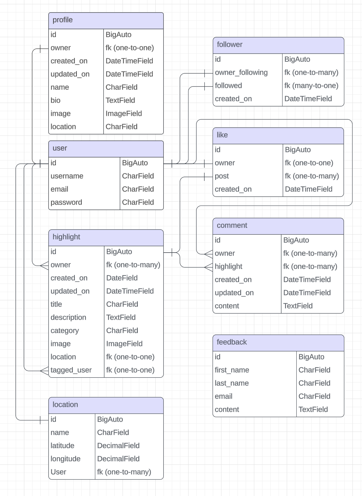

**Portfolio Project 5**

# Highlights // Your Highlights Journal

**What was the best part of your day?**

Possible features to implement that are not in the Moments walkthrough:

- Link to another user in a highlight
- Add a category to a highlight
- Add a location to a highlight
- A calendar view at the top of users profiles with links to the highlights
- Feedback form for users to send to admin

## About

Highlights ia a social media platform designed to cultivate gratitude and positivity in everyday life. Inspired by the principles of the Five Minute Journal, our platform provides users with a space to share the highlights of their day and connect with others in a supportive online community.

Key Features:
- Highlight Sharing: Easily post and share the highlights of your day, complete with text descriptions, images, user tags and locations.
- Interactive Features: Engage with other users' highlights through likes, comments, and following other users.
- Search and Discovery: Explore highlights by keywords, categories, and user tags to find inspiration and connect with like-minded individuals.
- Calendar Integration: Visualize and track your daily highlights over time with a convenient calendar interface.

## UX

I followed the five planes of Website Design in the creation of this project.

### 1. Strategy

My strategy is to develop a social media platform designed to foster gratitude and enhance users perspective on life. Drawing inspiration from the principal of the five minute journal, the platform aims to provide a space where individuals can share their best highlights of their day. Grounded in scientific research on the benefits of gratitude, the platform aims to cultivate a positive online community.

Key features:
- Highlight sharing: Users can post the highlights of their day, promoting reflection and appreciation for positive moments.
- Interactive Features: To encourage engagement, user have the option to add categories, attach images, tag other users in their posts and add locations.
- Search Functionality: Users can search for highlights by tags, category, or location.
- User profiles: Users can view their profile and share their highlights with other users.
- Calendar display: Users can view their highlights on a calendar view.
- Follow and Un-follow: Users can follow and un-follow other users.

#### User Stories

Create an account & Login
- As a user I can view the landing page with information about the platform so I can learn more about it.
- As a user I can see the navbar on every page so I can easily navigate the site.
- As a logged out user I can see the login and sign up links in the navbar so I can navigate to them easily.
- As a new user I can create an account so I can log in and use the features.
- As a returning user I can log in to my account so I can enjoy the site.
- As a logged in user I can maintain my logged in status so I can keep using the site.
- As a logged in user I can see the add highlight, liked, profile and logout links in the navbar so I can easily navigate to them.

Creating Highlights
- As a user I can create a highlight so I can share my thoughts and feelings.
- As a user I can tag another user in my highlight so I can show my support for them.
- As a user I can add a tag to my highlight so I can categorize it.
- As a user I can add a location to my highlight so I can show where I was when I made that highlight.
- As a user I can add an image to my highlight so everyone can see it.
- As a user I can add a description to my highlight so there is more detail to read.
- As a user I can update one of my highlights so I can fix any mistakes I made.
- As a user I can delete one of my highlights so I can remove it from the site.

The Feed
- As a user I can see highlights ordered by the most recent so that each time I visit the site the content is fresh.
- As a user I can continue scrolling through the highlights without having to refresh the page or click next so that I can see more highlights.
- As a user I can see the posts of users that I follow so that I can see what they are up to.
- As a user I can see posts I have likes so that I can revisit the moments that I enjoyed.
- As a user I can search for for keywords so that I can to discover content I am interested in.
- As a user I can filter by category so I can see highlights that I am interested in.
- As a user I can filter by location so I can see highlights that are close to me.

Profile pages
- As a user I can add a profile avatar so I can show my picture.
- As a user I can add a bio so I can show my story.
- As a user I can add a name so I can show my name.
- As a user I can add a location so I can show my location.
- As a user I can edit my profile so I can update any information I need to.
- As a user I can change my password so I can protect my account.
- As a user I can view other users profiles so I can see their highlights and find out more about them.
- As a user I can see a list of the top profiles so I can see who is most active on the site.
- As a user I can see all the highlight from a user in their profile so I can see what they are up to.
- As a user I can see how many followers, following and posts users have in their profile so I can see how active they are.

Interactivity
- As a user I can like/unlike another users highlight so I can show my support for it.
- As a user I can comment on another users highlight so I can start a conversation.
- As a user I can update a comment I have made on another users highlight so I can fix any mistakes I made.
- As a user I can delete a comment I have made on another users highlight so I can remove it from the site.
- As a user I can follow another user so I can see their highlights in my feed.
- As a user I can un-follow a user so I no longer see their highlights in my feed.

General
- As a site owner I want the site to be fully responsive across all screen sizes so it can be used on any device.
- As a site owner I want the site to be easy to use so I can easily navigate and use it.
- As a site owner I want the site to be secure so I can use it safely and securely.
- As a site owner I want a 404 page so users know when they have tried to access a page that does not exist.
- As a user I want messages feedback messages to be shown when I create, update or delete a highlight or comment so that I can see if I am using the site correctly.

### 2. Scope

- Purpose: The purpose of the website is to provide a platform for users to share the highlight of their day, fostering gratitude and a positive outlook on life. The website aims to create a supportive online community where users can connect, inspire and uplift each other.
- Target Audience: The target audience includes individuals who are interested in personal development, mindfulness, and self-improvement. This may include a diverse range of demographics, including young adults, professionals, parents, and students, who share a common interest in cultivating gratitude and positivity.
- Core Functionality:
    - Highlight sharing: Users can easily post and share the highlights of their day, including text descriptions, images, locations, categories and other users.
    - Interactive features: The website enables users to engage with each others highlights through likes and comments, fostering a sense of community and connection.
    - Search and Discovery: Robust search functionality allows users to search for highlights by tags, category, or location.
    - User profiles: Users can view each others profiles and comment on individual highlights.
    - Calendar display: The user can view their highlights on a calendar view, providing a convenient and efficient way to keep track of their highlights over time.
    - Follow and Un-follow: Users are able to follow or un-follow other users to foster a more engaged and connected community.

### 3. Structure
### 4. Skeleton

#### Database
[Database edit](https://lucid.app/lucidchart/416f6b5f-1a8f-402b-9a48-252b729ca79d/edit?page=0_0&invitationId=inv_6dc8ebbb-1811-4e2d-98d4-dd97f1f2b8be#)


To create a new app for a new model  
`python manage.py startapp <appname>`  
Then add it to the `INTALLED_APPS` list in settings.py

To migrate the changes to the database  
`python manage.py makemigrations`  
`python manage.py migrate`

To create a superuser  
`python manage.py createsuperuser`

##### User
The user model contains information about the user and is part of the Django allauth library
- One-to-one relationship with the profile model's owner field
- ForeignKey relationship with the follower model's owner & followed fields
- ForeignKey relationship with the highlight model's owner & tagged_users fields
- ForeignKey relationship with the tagged_users model's highlight_owner & tagged_user fields
- ForeignKey relationship with the like model's owner field
- ForeignKey relationship with the comment model's owner field

##### Profile
The profile model contains the following information used in users profiles
- id
- owner (ForeignKey)
    - One to one relationship with the user model's id field
- created_on
- updated_on
- name
- bio
- image

##### Follower

##### highlight

##### Location

- id
- name
- latitude models.DecimalField(max_digits=9, decimal_places=6) 
- longitude

##### Like

##### Comment

#### Wireframes


### 5. Surface


## Technologies Used

To create a requirements.txt file with all the dependencies  
`pip freeze > requirements.txt`

### Languages and Frameworks

- Python
- Django Rest Framework  
`pip install djangorestframework`

### Libraries & Tools

- [Cloudinary](https://cloudinary.com/) - Image storage
- [Pillow](https://pypi.org/project/pillow/) - Image processing

A full list of the requirements and the versions used can be found in the requirements.txt file. To install them and run them on your own machine first setup a virtual environment with the command to create a venv...  
`python3 -m venv venv`  
Then this command to run the venv run the command  
`source venv/bin/activate`  
To stop running the environment simply type the command  
`deactivate`  
To install the requirements use the command, make sure your venv is activated  
`pip install -r requirements.txt`  

## Project Setup

1. Use the [Code Institute Template](https://github.com/Code-Institute-Org/gitpod-full-template) to create a new repository on GitHub.
2. Install Django Rest Framework with the following command
    - `pip3 install 'django<4'`
3. Initialize the project with the following command
    - `django-admin startproject drf_highlights .`
4. Install Django Cloudinary Storage for image storage with the following command
    - `pip install django-cloudinary-storage`
5. Install Pillow for image processing with the following command
    - `pip install Pillow`
6. Add `cloudinary` and `cloudinary_storage` to `INSTALLED_APPS` in settings.py with `django.contrib.staticfiles` between them
```
INSTALLED_APPS = [
    'django.contrib.admin',
    'django.contrib.auth',
    'django.contrib.contenttypes',
    'django.contrib.sessions',
    'django.contrib.messages',
    'cloudinary_storage', 
    'django.contrib.staticfiles',
    'cloudinary',
]
```
7. Create an env.py file in the base directory and add `import os` at the top, then add the cloudinary API Environment variable
```
import os

os.environ['CLOUDINARY_URL'] = '<Cloudinary API Environment variable>'
```
8. Back in settings.py 
    - add import os and env.py (if it it present)
    - set `CLOUDINARY_STORAGE` to the `CLOUDINARY_URL`
    - set `MEDIA_URL` so the settings knows where to put the image files
    - set the `DEFAULT_FILE_STORAGE` to `cloudinary_storage.storage.MediaCloudinaryStorage`
```
import os

if os.path.exists('env.py'):
    import env

CLOUDINARY_STORAGE = {
    'CLOUDINARY_URL': os.environ.get('CLOUDINARY_URL')
}
MEDIA_URL = '/media/'
DEFAULT_FILE_STORAGE = 'cloudinary_storage.storage.MediaCloudinaryStorage'
```

## Deployment

### Setup JSON Web Tokens

1. install JSON Web Token authentication run terminal command:  
`pip install dj-rest-auth==2.1.9`
2. Add 'rest_framework.authtoken' and 'dj_rest_auth' to the list of INSTALLED_APPS in settings.py as below:
```
INSTALLED_APPS = [
    'django.contrib.admin',
    'django.contrib.auth',
    'django.contrib.contenttypes',
    'django.contrib.sessions',
    'django.contrib.messages',
    'cloudinary_storage',
    'django.contrib.staticfiles',
    'cloudinary',
    'location_field.apps.DefaultConfig',
    'rest_framework',
    'django_filters',
    'rest_framework.authtoken',
    'dj_rest_auth',
    ...
]
```
3. Add the dj-rest-auth urls paths to the main urls.py file as below:
```
urlpatterns = [
    path('admin/', admin.site.urls),
    path('api-auth/', include('rest_framework.urls')),
    path('dj-rest-auth/', include('dj_rest_auth.urls')),
    ...
]
```
4. Migrate the database with terminal command:  
`python manage.py migrate`

5. For users to be able to register, install Django AllAuth with terminal command:  
`pip install 'dj-rest-auth[with_social]'`

6. Add the following INSTALLED_APPS to settings.py:  
```
    'django.contrib.sites',
    'allauth',
    'allauth.account',
    'allauth.socialaccount',
    'dj_rest_auth.registration',
```
7. Set SITE_ID in settings.py to 1:  
`SITE_ID = 1`

8. Add the registration urls below to the main urls.py file:  
```
    path(
        'dj-rest-auth/registration/', include('dj_rest_auth.registration.urls')
    ),
```

9. To install the JSON tokens, run terminal command:  
`pip install djangorestframework-simplejwt`

10. Set DEV to 1 in the env.py file:  
`os.environ['DEV'] = '1'`

11. This value can be used to check if project is in development or production. Add the following if/else statement to settings.py:
```
REST_FRAMEWORK = {
    'DEFAULT_AUTHENTICATION_CLASSES': [(
        'rest_framework.authentication.SessionAuthentication'
        if 'DEV' in os.environ
        else 'dj_rest_auth.jwt_auth.JWTCookieAuthentication'
    )],
}
```

12. - To enable token authentication, set REST_USE_JWT to True.  
    - To ensure tokens are sent over HTTPS only, set JWT_AUTH_SECURE to True.  
    - Cookie names must also be declared. To do all of this, add the following code below the if/else statement just added to settings.py:
```
REST_USE_JWT = True
JWT_AUTH_SECURE = True
JWT_AUTH_COOKIE = 'my-app-auth'
JWT_AUTH_REFRESH_COOKIE = 'my-refresh-token'
```

13. Create serializers.py file in the main app directory (drf_highlights), and copy UserDetailsSerializer code from Django documentation as follows:
```
from dj_rest_auth.serializers import UserDetailsSerializer
from rest_framework import serializers


class CurrentUserSerializer(UserDetailsSerializer):
    profile_id = serializers.ReadOnlyField(source='profile.id')
    profile_image = serializers.ReadOnlyField(source='profile.image.url')

    class Meta(UserDetailsSerializer.Meta):
        fields = UserDetailsSerializer.Meta.fields + (
            'profile_id', 'profile_image'
        )
```

14. Overwrite the default user detail serializer in settings.py with the following:  
```
REST_AUTH_SERIALIZERS = {
    'USER_DETAILS_SERIALIZER': 'drf_highlights.serializers.CurrentUserSerializer'
}
```

15. Migrate the database again with command:  
`python manage.py migrate`

16. Update requirements.txt file with new dependencies by running command:  
`pip freeze > requirements.txt`

17. Add, commit and push changes.

### Prepare API for deployment to Heroku

1. To add a custom message to the root_route, create a views.py file in the drf_highlights directory and add the following code:
```
from rest_framework.decorators import api_view
from rest_framework.response import Response


@api_view()
def root_route(request):
    return Response({
        "message": "Welcome to The Highlights DRF API!"
    })
```

2. Import it into the main urls.py file, and add the following to the top of the urlpatterns list:  
```
from .views import root_route

urlpatterns = [
    path('', root_route),
    ...
]
```

3. To set up page pagination, inside settings.py add the following to REST_FRAMEWORK:  
```
REST_FRAMEWORK = {
    'DEFAULT_AUTHENTICATION_CLASSES': [(
        'rest_framework.authentication.SessionAuthentication'
        if 'DEV' in os.environ
        else 'dj_rest_auth.jwt_auth.JWTCookieAuthentication'
    )],
    'DEFAULT_PAGINATION_CLASS':
    'rest_framework.pagination.PageNumberPagination',
    'PAGE_SIZE': 10,
}
```

4. Set the default renderer to JSON for the production environment. In settings.py add the following:  
```
if 'DEV' not in os.environ:
    REST_FRAMEWORK['DEFAULT_RENDERER_CLASSES'] = [
        'rest_framework.renderers.JSONRenderer',
    ]
```

5. To set up DATETIME_FORMAT, add the following to settings.py (inside REST_FRAMEWORK, under PAGE_SIZE):  
```
'DATETIME_FORMAT': '%d %b %y',
```

6. To show how long ago a comment was created, set DATETIME format inside the serializers.py file within the comments app:  
```
from django.contrib.humanize.templatetags.humanize import naturaltime

created_on = serializers.SerializerMethodField()
updated_on = serializers.SerializerMethodField()

    def get_created_on(self, obj):
        """Method to display when comment was posted"""
        return naturaltime(obj.created_on)

    def get_updated_on(self, obj):
        """Method to display when comment was updated"""
        return naturaltime(obj.updated_on)

```

7. Add, commit and push changes.

### Deploy to ElephantSQL

1. Log into ElephantSQL and create a new instance.

2. Select the free plan.

3. Select a local region.

4. Click on 'Create Instance'

5. Back on the dashboard click on the instance you just created.

6. In the URL section, click the copy icon to copy the database URL.

### Create a Heroku app

1. Log into Heroku.

2. Create a new app.

3. Go to 'Settings', click on 'Reveal Config Vars' and add the ElephantSQL DATABASE_URL (without any quotes).

4. In the terminal, install dj_database_url and psycopg2, both of these are needed to connect to your external database: 
`pip3 install dj_database_url==0.5.0 psycopg2`

5. In your settings.py file, import dj_database_url underneath the import for os:
```
import os
import dj_database_url
```

6. Update the DATABASES section to the following:
```
if 'DEV' in os.environ:
    DATABASES = {
        'default': {
            'ENGINE': 'django.db.backends.sqlite3',
            'NAME': BASE_DIR / 'db.sqlite3',
    }
}
else:
    DATABASES = {
        'default': dj_database_url.parse(os.environ.get("DATABASE_URL"))
    }
```  
This will ensure that when you have an environment variable for DEV in your environment the code will connect to the sqlite database here in your IDE. Otherwise it will connect to your external database, provided the DATABASE_URL environment variable exist.

7. In your env.py file, add a new environment variable with the key set to DATABASE_URL, and the value to your ElephantSQL database URL:
```
os.environ['DATABASE_URL'] = "<your PostgreSQL URL here>"
```  
Remember to add quotes as this needs to be a string.

8. Temporarily comment out the DEV environment variable so that your IDE can connect to your external database:
```
import os

os.environ['CLOUDINARY_URL'] = "cloudinary://..."
os.environ['SECRET_KEY'] = "Z7o..."
# os.environ['DEV'] = '1'
os.environ['DATABASE_URL'] = "postgres://..."
```

9. Back in your settings.py file, add a print statement to confirm you have connected to the external database
```
else:
    DATABASES = {
        'default': dj_database_url.parse(os.environ.get("DATABASE_URL"))
    }
    print('connected')
```

10. In the terminal, -–dry-run your makemigrations to confirm you are connected to the external database:  
`python3 manage.py makemigrations --dry-run`  
If you are, you should see the ‘connected’ message printed to the terminal.

11. Remove the print statement.

12. Migrate your database models to your new database:
`python3 manage.py migrate`\

13. Create a superuser for your new database:
`python3 manage.py createsuperuser`

### Confirm the migration

1. On the ElephantSQL page for your database, in the left side navigation, select “BROWSER”

2. Click the Table queries button, select auth_user

3. When you click “Execute”, you should see your newly created superuser details displayed. This confirms your tables have been created and you can add data to your database.

### Prepare Project for deployment to Heroku

1. In the terminal of your IDE workspace, install gunicorn
`pip3 install gunicorn django-cors-headers`

2. Update your requirements.txt
`pip freeze --local > requirements.txt`

3. Heroku also requires a `Procfile`. Create this file now. Remember, it must be named correctly and not have any file extension, otherwise Heroku won’t recognise it

4. Inside the Procfile, add these two commands
```
release: python manage.py makemigrations && python manage.py migrate
web: gunicorn drf_api.wsgi
```  
Save the file.

5. In your settings.py file, update the value of the ALLOWED_HOSTS variable to include your Heroku app’s URL
```
ALLOWED_HOSTS = ['localhost', '<your_app_name>.herokuapp.com']
```

6. Add corsheaders to INSTALLED_APPS:
```
INSTALLED_APPS = [
    ...
    'dj_rest_auth.registration',
    'corsheaders',
    ...
]
```

7. Add corsheaders middleware to the TOP of the MIDDLEWARE:
```
MIDDLEWARE = [
    'corsheaders.middleware.CorsMiddleware',
    ...
]
```

8. Under the MIDDLEWARE list, set the ALLOWED_ORIGINS for the network requests made to the server with the following code:
```
if 'CLIENT_ORIGIN' in os.environ:
    CORS_ALLOWED_ORIGINS = [
        os.environ.get('CLIENT_ORIGIN')
    ]
else:
    CORS_ALLOWED_ORIGIN_REGEXES = [
        r"^https://.*\.gitpod\.io$",
    ]
```  
Here the allowed origins are set for the network requests made to the server. The API will use the CLIENT_ORIGIN variable, which is the front end app's url. We haven't deployed that project yet, but that's ok. If the variable is not present, that means the project is still in development, so then the regular expression in the else statement will allow requests that are coming from your IDE.

9. Enable sending cookies in cross-origin requests so that users can get authentication functionality
```
else:
    CORS_ALLOWED_ORIGIN_REGEXES = [
        r"^https://.*\.gitpod\.io$",
    ]

CORS_ALLOW_CREDENTIALS = True
```

10. To be able to have the front end app and the API deployed to different platforms, set the JWT_AUTH_SAMESITE attribute to 'None'. Without this the cookies would be blocked.
```
JWT_AUTH_COOKIE = 'my-app-auth'
JWT_AUTH_REFRESH_COOKE = 'my-refresh-token'
JWT_AUTH_SAMESITE = 'None'
```

11. Remove the value for SECRET_KEY and replace with the following code to use an environment variable instead.
```
SECRET_KEY = os.getenv('SECRET_KEY')
```

12. Set a NEW value for your SECRET_KEY environment variable in env.py, do NOT use the same one that has been published to GitHub in your commits  
[Django Secret Key Generator](https://djecrety.ir/)  
```
os.environ.setdefault("SECRET_KEY", "CreateANEWRandomValueHere")
```

13. Set the DEBUG value to be True only if the DEV environment variable exists. This will mean it is True in development, and False in production.
```
DEBUG = 'DEV' in os.environ
```

14. Comment DEV back in env.py
```
import os

os.environ['CLOUDINARY_URL'] = "cloudinary://..."
os.environ['SECRET_KEY'] = "Z7o..."
os.environ['DEV'] = '1'
os.environ['DATABASE_URL'] = "postgres://..."
```

15. Ensure the project requirements.txt file is up to date. In the IDE terminal of your DRF API project enter the following:
`pip freeze --local > requirements.txt`

16. Add, commit and push your code to GitHub

### Deploying to Heroku

1. Back on the Heroku dashboard for your new app, open the Settings tab.

2. Add two more Config Vars:
    - SECRET_KEY (you can make one up, but don’t use the one that was originally in the settings.py file!)
    - CLOUDINARY_URL, and for the value, copy in your Cloudinary URL from your env.py file (do not add quotation marks!)
    - You should already have DATABASE_URL (postgress) and DISABLE_COLLECTSTATIC (set to 1)

3. Open the Deploy tab.

4. In the Deployment method section, select Connect to GitHub.

5. Search for your repo and click Connect

6. Optional: You can click Enable Automatic Deploys in case you make any further changes to the project. This will trigger any time code is pushed to your GitHub repository

7. Under Manual deploy click `Deploy Branch`

8. Your app should be successfully deployed to Heorku. If there was an error and you need to view your logs log in to heroku with the following command:  
`heroku login`  
Then to view the logs:  
`heroku logs --tail --drf-highlights`


## Validation

## Testing

## Bugs

- I had a circular import between highlight and location. Removing the highlight import fixed the issue. I also had to allow the field to be null as there are some highlights that do not have a location.