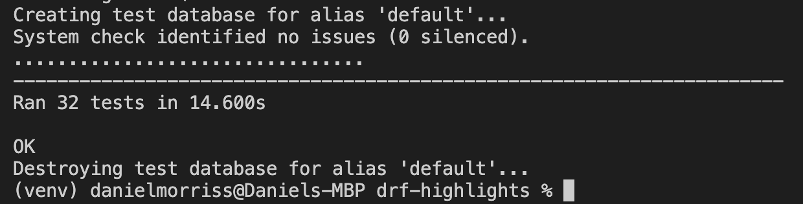

# Highlights DFR API - Testing

## Validation

- All files were passed through the [Code Institute PEP8 Validation Tool](https://pep8ci.herokuapp.com/) and came back with no errors, with the exception of some lines being too long in settings.py. As these were URL's and could not be shortened I decided to leave them in.

## Unit Testing
 
- Unit tests were created for each of the database models, views and serializers and all passed.

The following tests were created:

### Comments
- test_non_logged_in_user_cannot_create_a_comment
- test_logged_in_user_can_create_a_comment
- test_user_cannot_create_a_comment_with_no_content
- test_user_can_get_comment_by_id
- test_user_cannot_get_comment_with_invalid_id
- test_user_can_update_their_own_comment
- test_user_can_delete_their_own_comment
- test_user_can_delete_their_own_comment
- test_user_cannot_delete_someone_elses_comment

### Feedback
- test_non_logged_in_user_can_submit_feedback
- test_logged_in_user_can_submit_feedback
- test_user_cannot_submit_feedback_without_content
- test_user_cannot_submit_feedback_without_email
- test_user_can_view_feedback

### Followers
- test_non_logged_in_user_cannot_follow
- test_logged_in_user_can_follow_a_user
- test_user_can_unfollow_a_user

### Highlights
- test_can_get_highlight_by_id
- test_cannot_get_highlight_with_invalid_id
- test_user_can_update_their_own_post
- test_user_cannot_update_someone_elses_post

### Likes
- test_non_logged_in_user_cannot_like
- test_logged_in_user_can_like_a_highlight
- test_user_can_unlike_a_highlight
- test_user_cannot_unlike_another_users_like

### Location
- test_user_can_add_a_location
- test_user_can_delete_location
- test_user_can_rename_location

### Profiles
- test_non_logged_in_user_can_view_existing_profile
- test_logged_in_user_can_view_their_profile
- test_logged_in_user_can_view_other_users_profile
- test_user_cannot_view_non_existent_profile
- test_user_can_update_username

## Manual Testing

### URL Testing

The following URLs were tested:

| URL         | Result |
|-------------|--------|
| /           | Pass   |
| /comments   | Pass   |
| /feedback   | Pass   |
| /followers  | Pass   |
| /highlights | Pass   |
| /likes      | Pass   |
| /locations  | Pass   |
| /profiles   | Pass   |

### CRUD Testing

All apps were tested for full Create, Read, Update and Delete functionality.

